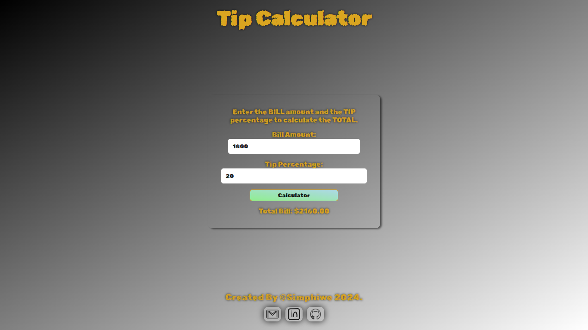
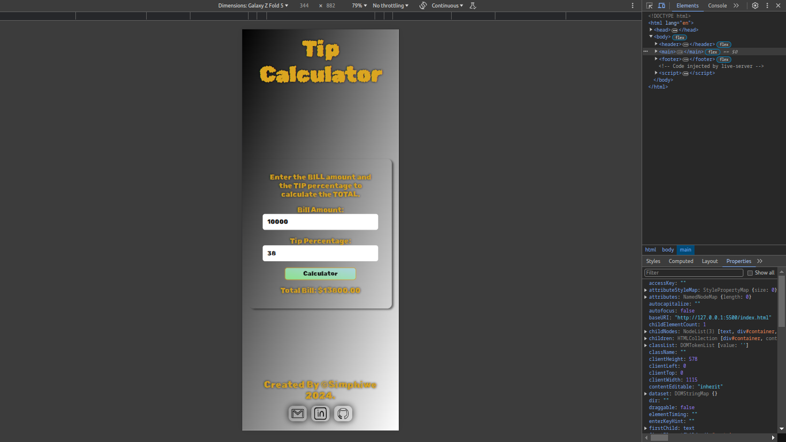

# Tip Calculator

Check it _**LIVE**_ 👉
**<https://deebest.github.io/tip-calculator/>**

A _**Tip Calculator**_ web application I built with HTML,CSS and JavaScript, I built it as a part of my JavaScript learning journey.

## Uses

Can be used to calculate the total after the percentage is added in

## Tech Stack Used

- GIT
- HTML
- CSS
- JavaScript

## Get In Touch 👇

Email : **<simphiwedladla8@gmail.com>**

Linked: **<https://www.linkedin.com/in/dladla-simphiwe-89061a20a/>**

Github: **<https://github.com/DeeBest>**

Portfolio: **<https://deebest.github.io/personal-webpage/>**
